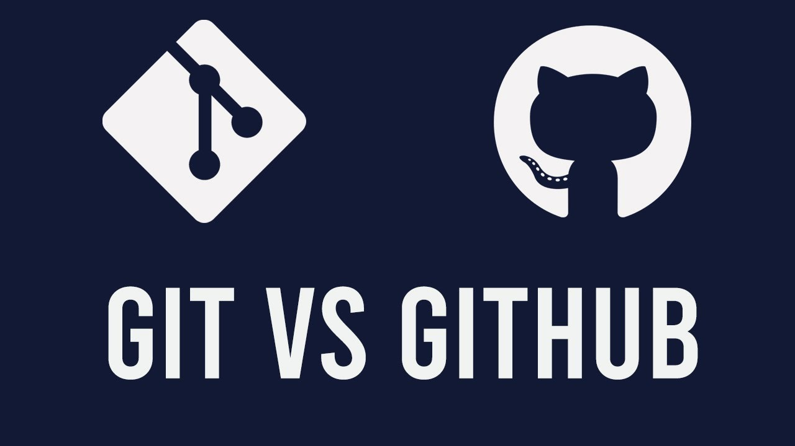

Критерии оценки выполненного задания
0 баллов

Задание не выполнено.
5 баллов

Работа загружена на GitHub.
Использованы основные возможности Markdown: 
- изображения, 
[Подсказки для работы с Markdown](https://yandex.ru/images/search?text=markdown%20%D1%81%D0%B8%D0%BD%D1%82%D0%B0%D0%BA%D1%81%D0%B8%D1%81%20%D1%88%D0%BF%D0%B0%D1%80%D0%B3%D0%B0%D0%BB%D0%BA%D0%B0&lr=137330&pos=2&img_url=http%3A%2F%2Fs2.studylib.es%2Fstore%2Fdata%2F008825178_1-f39e56009941736933e722fe371a5cd3.png&rpt=simage)
- [ ] полужирный,

- [ ] курсив,

- [ ] ссылки,

- [ ] код,

- [ ] заголовки
| 1 уровень | 2 уровень | 3 уровень | 4 уровень | 5 уровень | 6 уровень |
|---|---|---|---|---|---|
|# Первый |## Второй |### Третий |#### Четвертый |##### Пятый |###### Шестой |

Описаны основные команды Git.

# Основные команды для работы с git
15 марта 2023

### [Алексеев Сергей](https://github.com/ValenHouse/SkillFacktory/tree/master/Modul_3)
___

Когда кто-то открывает **ваш проект на GitHub** первое, что попадётся ему на глаза это README файл. README это файл, как правило с расширением md реже txt, который содержит информацию о том или ином программном продукте: библиотеке, фреймворке, мини-скриптике или полноценном проприетарном ПО. В этот файл помещают краткое описание о проекте, что это, зачем он нужен, документацию, примеры использования, требования,
имена авторов программы, историю версий, примечания и многое другое. Поэтому не трудно догадаться что README является лицом вашего проекта. 
*Поэтому грамотно оформленный, качественный README может выставить вас в выгодном свете и произвести хорошее первое впечатление, как на случайных пользователей, так и на потенциальных работодателей, которые будту просматривать ваши проекты*. 
___

Работа с Git через терминал — это обязательная часть практики фронтендера. Однако для начинающих разработчиков этот инструмент может показаться сложным. 

## Первоначальная настройка Git

***Указать имя пользователя*** — git config --global user.name "Ivan Ivanov". Задаёт имя пользователя, от которого будут идти коммиты. Вместо Ivan Ivanov нужно написать свои данные на латинице. Если имя состоит из одного слова, кавычки можно не ставить.

___Указать электронную почту___ — git config --global user.email "mail@gmail.com". Вместо mail@gmail.com нужно указать вашу почту. Обратите внимание, она должна совпадать с той, на которую зарегистрирован аккаунт в Гитхабе.

Посмотреть настройки — git config --list. Параметры можно посмотреть и в конфигурационном файле, но этот способ быстрее.

## Работа с репозиторием
<!--- Цитаты --->
> Создать репозиторий — git init. Инициализирует пустой репозиторий.

>> Склонировать удалённый репозиторий — git clone [ссылка на удалённый репозиторий]. Проект появится в директории, где вы находились в момент клонирования.

>>> Связать удалённый и локальный репозитории — git remote add origin [ссылка на удалённый репозиторий].

## Работа с изменениями
+ Любая работа с изменениями начинается с получения последней версии проекта из удалённого репозитория. Далее вы можете внести правки в проект, добавить изменения в индекс и сделать коммит. В конце нужно отправить изменения в удалённый репозиторий или удалить, если они больше не нужны.

+ Подтянуть изменения — git pull. Подтягивает в локальный репозиторий последнюю версию проекта. Будьте внимательны, вызов этой команды сотрёт все незафиксированные изменения. Иногда после ввода этой команды появляется конфликт.

+ Посмотреть статус файлов — git status. Вы увидите, какие файлы изменили, удалили или добавили в проект. При этом статус «Закоммичен» не отобразится.

+ Добавить файлы в индекс — git add [название файла]. После ввода этой команды вы можете сделать коммит.

  + Есть похожие команды, например, git add . индексирует сразу все изменённые файлы и папки в директории, где вы находитесь. Обратите внимание, между точкой и словом add нужно ставить пробел. Команда
git add :/ добавляет в индекс все файлы независимо от того, в какой директории вы находитесь.
```HTML
Сделать коммит — git commit -m "Комментарий к коммиту" — фиксирует изменения. До выполнения этой команды локальные изменения никуда не запишутся.

1. Посмотреть историю коммитов — git log. 
    1. Выводит список всех коммитов. 
    2. У этой команды есть разные опции, самая используемая из них — oneline. 
    3. Она показывает хеш в укороченном формате, ветку, в которой сделан коммит, а также текст коммита.
    4. Чтобы использовать эту опцию (как и любую другую), нужно добавить её после команды: git log--oneline.

2. Запушить изменения — git push. 
    1. Отправляет все зафиксированные изменения с локального репозитория в удалённый.
    2. Это одна из самых важных команд, ведь все вышеописанные действия производятся в локальной копии репозитория.
    3. Когда вы закончите работу, эту копию нужно будет отправить в удалённый репозиторий.
    4. Только так другие участники процесса смогут получить актуальную версию.
```

## Работа с ветками
Работая с Git, приходится постоянно создавать и перемещаться по веткам. А иногда ветки нужно удалять или сливать.

- [ ]Здесь можно использовать branch-name. При вводе команды нужно указать название вашей ветки.

- [x] Создать ветку — git switch --create branch-name. Добавляет новую ветку с названием branch-name и автоматически переключает на неё.

- [x] Переключить ветку — git switch branch-name. Вы перейдёте на уже созданную ветку branch-name.

Для создания и переключения веток также можно использовать git checkout. 
Эта команда появилась раньше, у неё есть множество дополнительных функций. Например, она может восстанавливать изменения в коммите. Как раз из-за такого разнообразия задач разработчики решили создать отдельную команду для переключения между ветками — git switch. Вы можете использовать любую из команд, однако git switch доступна только в версиях от 2.23.

Посмотреть все локальные ветки — git branch.

Переименовать ветку — git branch -m [старое-название-ветки] [новое-название-ветки] — переименовывает ветку. Названия нужно писать на латинице.

Отправить ветку — git push origin [branch-name] — отправляет ветку в удалённый репозиторий.

Удалить ветки — git branch --delete [branch-name]. Команда удаляет ветку [branch-name] в локальном репозитории. Если нужно избавиться от ветки в удалённом репозитории, используйте git push --delete origin [branch-name].

Влить ветки — git merge [branch-name]. Вливает ветку branch-name в ветку, в которой вы находитесь.

Перебазировать коммиты — git rebase [branch-name]. Перебазирует коммиты из ветки, в которой вы находитесь, в ветку [branch-name].

Создать точную копию коммитов — git cherry-pick. Команду часто совмещают с git merge и git rebase, чтобы сохранить линейную историю коммитов. То есть создаётся точная копия коммитов, выполняется перебазирование и слияние веток.

## Откладывание и удаление
Отложить изменения — git stash push. Откладывает изменения, чтобы вы, например, могли срочно перейти к другой задаче. Чтобы отложить только часть изменений, используйте git stash --patch.

Вернуть отложенные изменения — git stash pop.

Отменить изменения, не добавленные в индекс — git restore [название файла]. Удалит изменения в одном файле. Чтобы удалить изменения во всех файлах, используйте git restore :/.

Отменить изменения, добавленные в индекс — git reset --hard. Возвращает изменения из индекса и полностью их отменяет.

Удалить коммит — git revert [195dfb0]. Вместо [195dfb0] указывается хеш коммита, его можно узнать с помощью команды git log.

Отменить слияние с конфликтом — git merge --abort. Используется, когда нет времени решать конфликт прямо здесь и сейчас.

Удалить лишнее — git clean. Команда «наводит чистоту» — удаляет неотслеживаемые файлы из рабочего каталога.

## Текст материала не является копией теории.
Гитигнор содержит основные шаблоны (редакторы кода).
В истории Git два и более коммита.
Сообщения коммитов осмыслены, но не многословны.
10 баллов

Выполнены все условия на 5 баллов.
Работа выполнена с творческим подходом и использованием других возможностей Markdown.
В работе более 10 связанных md-файлов.

# Инструкция по работе with GIT

License: [myself](license.md)



---

### Содержание:
1. Что такое Git
[git add](add.md)

---

Git logo - https://i.ytimg.com/vi/caHOmK9kFfI/maxresdefault.jpg, licese: [V.2](https://creativecommons.org/licenses/by-nc-sa/3.0/)